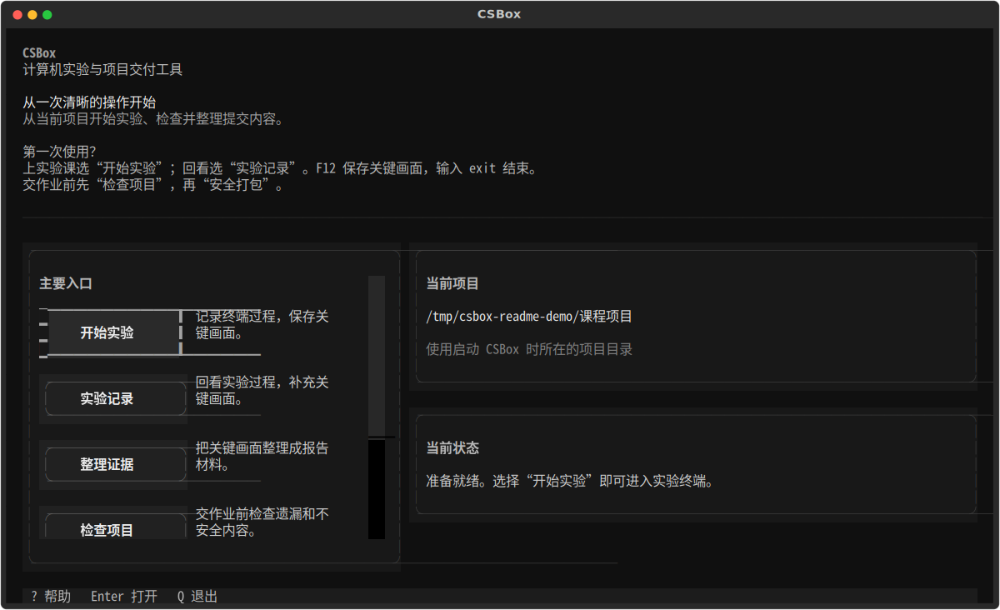
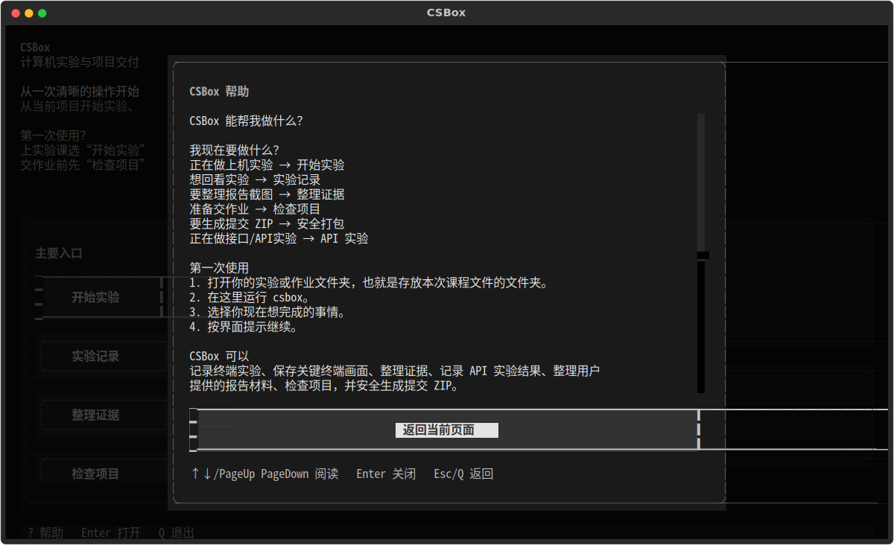
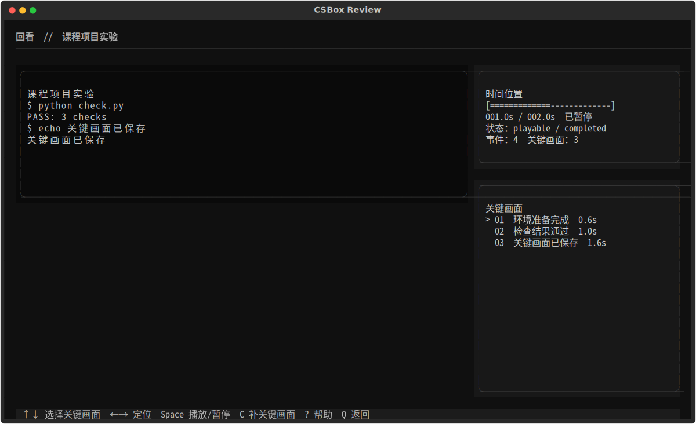
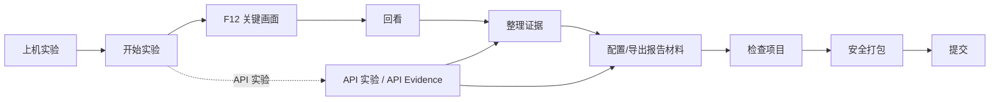

<div align="center">

# CSBox

### Local-first lab recording and course-project delivery for computer-science students

Record terminal work, keep evidence reviewable, and hand in a checked project bundle.

[English](README.md) · [简体中文](README.zh-CN.md)

[](https://github.com/sfwang3/CSBox/actions/workflows/ci.yml) [](https://www.python.org/) [](LICENSE) [](CHANGELOG.md)

**0.5.0rc1 · release candidate · not published to PyPI**

</div>

<p align="center"><a href="#what-can-i-actually-use-csbox-for">Use cases</a> · <a href="#first-time-using-csbox-start-here">Start here</a> · <a href="#quick-start">Quick Start</a> · <a href="#compatibility">Compatibility</a> · <a href="#faq">FAQ</a> · <a href="#for-contributors">Contributors</a></p>

CSBox is a local-first toolkit for computer-science students who need to turn lab and API work into organized, verifiable course-project materials. It records the work around your experiment; you remain responsible for the experiment, evidence, and writing.

## What can I actually use CSBox for?

| Problem | What to do | What you get |
| --- | --- | --- |
| I need screenshots during a lab. | Choose **开始实验**, work in its real terminal, and press <kbd>F12</kbd> at important states. | A replayable session and named **关键画面** (Capture) records. |
| I forgot to take a screenshot until after the lab. | Open the ended session in **回看** (Review), move to the moment, and create a Capture. | A late-added Capture without rewriting the raw recording. |
| My terminal screenshots are scattered and hard to put in a report. | Open **整理证据**, create an **证据集** (Evidence Set), then order and caption selected Captures. | A stable, editable evidence handoff. |
| I am afraid I will submit the wrong files. | Run **检查项目** (Check) before delivery and read every PASS, WARN, FAIL, and SKIP. | Actionable findings about structure, artifacts, paths, secrets, and large files. WARN is a review signal, not proof that the project is safe. |
| My teacher wants a ZIP. | Preview **安全打包** (Pack), choose an output ZIP, and verify it. | A ZIP assembled from a temporary area that excludes known working data, caches, credentials, and the output itself. |
| I have an API experiment. | Import a static OpenAPI 3.0/3.1 template or use a TOML scenario, run the configured URL, and export **API 实验** (API Evidence). | Redacted PNG evidence, `api-evidence.md`, and `results.json`. |

## First time using CSBox? Start here

A course/project folder is simply the folder containing the files you are working on for one assignment. Open that folder first. On Windows File Explorer, **Open in Terminal** is a convenient way to open a terminal there.

Keep this mental model:

> **open the folder → open a terminal in that folder → run `csbox` → choose the current task from Home**

You do not need to memorize subcommands for the normal path. Home presents **开始实验**, **实验记录**, **整理证据**, **检查项目**, **安全打包**, and **API 实验** with visible status and next steps.

On Home, use <kbd>↑</kbd>/<kbd>↓</kbd> or <kbd>Tab</kbd> to move, press <kbd>Enter</kbd> to open, and press <kbd>?</kbd> or <kbd>F1</kbd> for help.

### Installation: what works today

This release candidate is **not on PyPI**. There is no public-index install command yet.

#### Ordinary users: install a local wheel

If a course staff member or project maintainer gives you a `csbox-0.5.0rc1-py3-none-any.whl` file, install that local file with `uv`:

```bash
uv tool install /path/to/csbox-0.5.0rc1-py3-none-any.whl
cd path/to/your-course-project
csbox
```

The candidate is not publicly published yet. If you do not have a local wheel or source checkout, there is no ordinary-user install route to copy today.

#### Contributors: run from a source checkout

```bash
git clone https://github.com/sfwang3/CSBox.git
cd CSBox
uv sync
uv run csbox --help
```

To make a local command from that checkout, run `uv build` and install the wheel it creates; then return to the course/project folder and run `csbox`. Contributor checks are documented below.

## Quick Start

From your course/project folder, run `csbox`. For a first terminal experiment:

```text
Home → 开始实验 → enter a name → work in the terminal → F12 → type exit → 实验记录 → 导出材料
```

For diagnostics, `csbox --help`, `csbox --version`, and `csbox doctor` are available. The current version prints:

```console
$ csbox --version
0.5.0rc1
```

## See the current UI

These are current Textual renders from deterministic synthetic fixtures, not concept art or mockups.

| Home | Global help | Review |
| --- | --- | --- |
| [](docs/assets/readme/home.png) | [](docs/assets/readme/help.png) | [](docs/assets/readme/review.png) |

Regenerate them with `uv run --with cairosvg python docs/tests/tooling/generate_readme_screenshots.py`.

## A student journey



## Before → after

| Before CSBox | After a checked handoff |
| --- | --- |
| Terminal work is easy to forget or scatter. | A replayable session and selected Captures preserve the useful moments. |
| Report images, notes, and project files are mixed together. | An Evidence Set and derived report materials give the work a clear handoff. |
| Submission contents are hard to inspect at the last minute. | Check findings and a verified ZIP assembled in a temporary area make the final review visible. |

## Features organized around your goals

### Record and capture

**Lab Evidence** starts a real terminal-backed session with recording and replay. <kbd>F12</kbd> saves the current terminal state as a Capture; it is not a desktop screenshot. **API Evidence** runs configured TOML scenarios or imported static OpenAPI 3.0/3.1 templates, stores redacted run views, and exports evidence.

### Organize

**回看** (Review) lets you replay an ended Lab session and add, rename, or remove Captures. **证据集** (Evidence Set) references source Captures, lets you reorder them, and stores your own display title, caption, and note without rewriting the raw recording.

### Build report materials

**报告材料** (Report) uses the Evidence Set and the course structure you provide. It exports `report.md`, `report.docx`, and `assets/*.png`. This is formatting and handoff, not report writing.

### Verify and deliver

**检查项目** (Check) inspects project structure, Git state, sensitive files, absolute-path clues, build artifacts, caches, logs, and large files. A `WARN` means “review this finding”; it is not the same as `PASS`, and it is not a blanket security guarantee. **安全打包** (Pack) assembles files in a temporary area, refuses unsafe or credential-like inputs, verifies the ZIP, and leaves the source project in place.

## Keyboard shortcuts

Only these shortcuts are part of the documented current UI contract:

- Lab: <kbd>F12</kbd> saves a Capture.
- Review: <kbd>↑</kbd>/<kbd>↓</kbd> select Captures; <kbd>←</kbd>/<kbd>→</kbd> seek; <kbd>Space</kbd> play/pause; <kbd>C</kbd> create; <kbd>E</kbd> edit; <kbd>Delete</kbd> remove; <kbd>J</kbd> jump; <kbd>Tab</kbd> cycle panes; <kbd>PageUp</kbd>/<kbd>PageDown</kbd> seek by a larger step; <kbd>Q</kbd>/<kbd>Esc</kbd> return.
- Help where applicable: <kbd>?</kbd> or <kbd>F1</kbd>.

## What files and exports look like

Project-local working data is stored below `.csbox/`:

```text
.csbox/
├── sessions/<session-id>/{session.cast, metadata.json, captures.json, checkpoints.json}
├── evidence/<evidence-set-id>.json
├── report-profiles/<evidence-set-id>.json
└── api/{scenarios/, runs/}
```

Lab export produces `evidence/<NN-title>.png`, `evidence.md`, `session.cast`, optional `commands.txt`, and a generated internal manifest. Report export produces `report.md`, `report.docx`, `assets/*.png`, and a generated internal report manifest. API export produces `evidence/*.png`, `api-evidence.md`, `results.json`, and a generated internal manifest.

Pack produces a ZIP and optionally `manifest.json`. It excludes `.csbox`, common build/cache/log directories, existing `.zip` files, `.env` and credential-like files, private keys, and the output itself. Check and Pack are safety aids; inspect the proposed submission yourself.

## Does / Does not

| CSBox does | CSBox does not |
| --- | --- |
| Record terminal experiments | Write experiment conclusions |
| Capture key terminal states | Generate coursework answers |
| Replay completed experiments | Fabricate evidence |
| Organize evidence | Require cloud services |
| Record API evidence | Require an LLM |
| Format user-provided report material | Act as a full Word editor |
| Check submissions |  |
| Safely package files |  |

## Local-first and privacy

Project state, sessions, Captures, API runs, Evidence Sets, report profiles, and generated materials are local files. CSBox has no account, cloud sync, automatic upload, or telemetry channel, and no LLM/AI runtime dependency. API Evidence calls the URLs configured in your scenarios, so local-first does not make API runs offline. These facts are not a blanket security guarantee; review outputs before sharing them.

## Compatibility

Automated CI evidence and native manual evidence are different kinds of evidence:

| Environment | Shell / boundary | Evidence and expectation |
| --- | --- | --- |
| Linux CI | Bash (`bash --noprofile --norc`) | Automated matrix covers tests, PTY integration, TUI, CJK layout, build, and install smoke. Zsh is optional when installed. |
| Linux / WSL | Bash; optional Zsh | Use the actual local environment; Linux CI is not a WSL claim. |
| Windows hosted CI | Windows PowerShell 5.1 and PowerShell 7 through the Windows terminal boundary | Current workflow includes hosted Python 3.11/3.14 and ConPTY/dedicated-host smoke. This is hosted workflow evidence, not proof of every physical terminal. |
| Native physical Windows | PowerShell 5.1/7, Windows Terminal or another host | Lab, PowerShell 7, and Review previously passed manual acceptance. Evidence/Report native manual acceptance was deferred. Do not read this as full acceptance of every workflow. |
| macOS | — | No macOS support claim is made here. |

Use `csbox doctor` to inspect the current OS, Python, shell availability, and terminal dimensions. On Windows, a terminal host may claim <kbd>F12</kbd> before CSBox receives it; use Review to add a Capture if needed.

## FAQ

<details><summary>What is CSBox for?</summary>Computer-science lab and API work that needs a local record, reviewable evidence, report materials, checks, and a delivery bundle.</details>

<details><summary>What should I open first?</summary>Open the course/project folder, open a terminal there, run `csbox`, and choose the task from Home.</details>

<details><summary>Does it take a desktop screenshot?</summary>No. <kbd>F12</kbd> captures the Lab terminal state only.</details>

<details><summary>What if I forgot a Capture?</summary>Open the ended session in Review, seek to the moment, and create one there.</details>

<details><summary>Will Review change my original recording?</summary>It keeps the raw `session.cast` playback intact. Captures you create, rename, or remove in Review are saved as separate Capture records; Evidence Set and report exports are separate handoff data.</details>

<details><summary>Does it write my report or answers?</summary>No. It formats the Evidence Set and sections you provide; it does not generate conclusions, answers, or coursework prose.</details>

<details><summary>Where is data stored?</summary>Project state is under `.csbox/`; user-level configuration follows platform conventions such as `%APPDATA%/CSBox/` on Windows or `$XDG_CONFIG_HOME/csbox/` / `~/.config/csbox/` on Unix-like systems.</details>

<details><summary>Does local-first mean API runs are offline?</summary>No. API Evidence calls the URLs configured by you.</details>

<details><summary>Can I continue after a Check WARN?</summary>Usually, yes. WARN does not by itself block Check or Pack, but it is a reviewable condition such as a dirty Git state, an artifact, a large file, or a path clue. Read the finding and decide; WARN is neither PASS nor proof of danger.</details>

<details><summary>What does Pack leave out?</summary>`.csbox`, common build/cache/log directories, existing `.zip` files, `.env` and credential-like files, private keys, and the output itself, subject to the actual project tree and configured rules. Review the preview.</details>

<details><summary>Can I use CSBox on Windows?</summary>Yes, with the stated boundary: hosted CI covers Windows PowerShell 5.1/7 and ConPTY smoke, while prior native manual acceptance covered Lab, PowerShell 7, and Review. Evidence/Report native manual acceptance was deferred, and a terminal host may intercept <kbd>F12</kbd>.</details>

<details><summary>Does CSBox need internet or AI?</summary>CSBox itself has no account, cloud sync, automatic upload, telemetry, or LLM dependency. API Evidence sends requests to the URLs you configure, so an API experiment may use the network.</details>

## Further details

- [Architecture](docs/ARCHITECTURE.md) — layers, persistence, and event flow.
- [Terminal backends](docs/TERMINAL_BACKENDS.md) — shell and platform boundary details.
- [API Evidence](docs/API_EVIDENCE.md) — scenarios, variables, redaction, and export.
- [Security boundaries](docs/SECURITY.md) — Check and Pack limits.
- [Session format](docs/SESSION_FORMAT.md) — recording details.
- [TUI design](docs/TUI_DESIGN.md) — beginner interaction and CJK layout.
- [CHANGELOG](CHANGELOG.md) — release history.

<details>
<summary>Advanced: direct CLI commands</summary>

The normal beginner path is still `csbox`. For automation or diagnostics, the current command groups include:

```bash
csbox lab list
csbox lab review [session-id]
csbox lab export <session-id>
csbox api
csbox check --plain
csbox pack --dry-run
csbox pack --verify
csbox report export <evidence-set-id>
```

</details>

<a id="for-contributors"></a>
<details>
<summary>For contributors</summary>

```bash
uv sync
uv run pytest tests/test_tui.py tests/test_tui_matrix.py -q
uv run ruff check .
uv run ruff format --check .
uv build
```

The full CI workflow also covers the Linux/Windows matrix, terminal integrations, CJK rendering, and install smoke. Direct CLI commands are an advanced and diagnostic interface; the normal beginner path remains `csbox`.

</details>

## License

CSBox is licensed under the Apache License 2.0 (SPDX identifier: `Apache-2.0`). See [LICENSE](LICENSE) for details.
