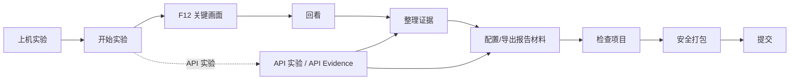

<div align="center">

# CSBox

### 面向计算机专业学生的本地优先实验记录与课程项目交付工具

记录终端操作，保留可回看的证据，交付经过检查的项目包。

[简体中文](https://github.com/sfwang3/CSBox/blob/main/README.md) · [English](https://github.com/sfwang3/CSBox/blob/main/README.en.md)

[](https://github.com/sfwang3/CSBox/actions/workflows/ci.yml) [](https://www.python.org/) [](LICENSE) [](CHANGELOG.md)

**0.6.0 · 稳定版已发布**

</div>

<p align="center"><a href="#use-cases-cn">使用场景</a> · <a href="#start-cn">从这里开始</a> · <a href="#quick-cn">快速开始</a> · <a href="#compatibility-cn">兼容性</a> · <a href="#faq-cn">常见问题</a> · <a href="#contributors-cn">贡献者</a></p>

CSBox 是一套面向计算机专业学生的本地优先工具：把上机实验和 API 操作变成有记录、可核对的课程项目材料。它记录实验周边的过程；实验怎么做、证据是否真实、报告写什么，始终由你负责。

```text
Lab Capture ─┐
             ├── Evidence Set ── Report
API Step ────┘
```

<a id="use-cases-cn"></a>
## 我到底能拿 CSBox 干什么？

| 你的问题 | 你可以这样做 | 最后得到什么 |
| --- | --- | --- |
| 上机时需要保存关键画面。 | 进入 **开始实验**，在真实终端中操作，在重要状态按 <kbd>F12</kbd>。 | 可回放的实验记录和命名后的 **关键画面**（Capture）。 |
| 实验结束才想起忘了截图。 | 在 **回看**（Review）中打开已结束记录，移动到相应时刻，再创建关键画面。 | 不改写原始回放的补录 Capture。 |
| 终端画面太散，整理报告很麻烦。 | 进入 **整理证据**，新建 **证据集**（Evidence Set），排序并编辑选中的关键画面或已保存 API 步骤。 | 适用于混合来源的稳定、可编辑证据交接层。 |
| 怕提交前漏掉或混入文件。 | 交付前运行 **检查项目**（Check），逐项阅读 PASS、WARN、FAIL、SKIP。 | 关于结构、产物、路径、凭据和大文件的可行动提示。WARN 只是需要复核，不等于项目安全。 |
| 老师要求提交 ZIP。 | 预览 **安全打包**（Pack），选择 ZIP 输出，然后验证。 | 在临时区域整理后生成的 ZIP，会排除已知工作数据、缓存、凭据和输出本身。 |
| 我在做 API 实验。 | 导入静态 OpenAPI 3.0/3.1 模板或使用 TOML 场景，调用配置好的 URL，再在 **整理证据** 中选择已保存步骤。 | 脱敏 API 运行记录，以及可加入混合证据集和报告的 API 步骤。 |

<a id="start-cn"></a>
## 第一次使用 CSBox？从这里开始

课程/项目文件夹，就是你为一次作业准备的那个文件夹，里面放着要操作的文件。先打开它。在 Windows 文件资源管理器中，**在终端中打开**可以方便地从这里启动终端。

只记住这一条思路：

> **打开文件夹 → 在该文件夹打开终端 → 运行 `csbox` → 从 Home 选择当前任务**

普通使用不需要背子命令。Home 会展示 **开始实验**、**实验记录**、**整理证据**、**检查项目**、**安全打包** 和 **API 实验**，并显示状态和下一步。

在 Home 中可以用 <kbd>↑</kbd>/<kbd>↓</kbd> 或 <kbd>Tab</kbd> 移动，按 <kbd>Enter</kbd> 打开，按 <kbd>?</kbd> 或 <kbd>F1</kbd> 查看帮助。

### 安装：从 PyPI 安装

`0.6.0` 是当前公开稳定版，使用 `uv` 从 PyPI 安装：

```bash
uv tool install csbox
cd path/to/your-course-project
csbox
```

#### 贡献者：从源码 checkout 运行

```bash
git clone https://github.com/sfwang3/CSBox.git
cd CSBox
uv sync
uv run csbox --help
```

如果要从该 checkout 得到本地命令，运行 `uv build`，再安装它生成的 wheel；然后回到课程/项目文件夹运行 `csbox`。贡献者检查命令在后面。

<a id="quick-cn"></a>
## 快速开始

在课程/项目文件夹中运行 `csbox`。第一次做上机实验可以按这个顺序：

```text
Home → 开始实验 → 输入名称 → 在终端中操作 → F12 → 输入 exit → 实验记录 → 导出材料
```

查看诊断信息可以使用 `csbox --help`、`csbox --version` 和 `csbox doctor`。当前版本输出：

```console
$ csbox --version
0.6.0
```

## 看看当前界面

下面三张截图按新手路径排列：先从 Home 选择要做的事，再进入真实终端记录，最后回看已保存的结果。截图来自当前 Textual 界面的确定性合成 fixture；fixture 数据是演示用的，界面不是概念图或 mockup。

### 1. 从 Home 开始

Home 是选择当前任务的入口：开始实验、查看记录、整理证据、记录 API 实验、检查项目或准备 ZIP。

<p align="center">
  <a href="https://raw.githubusercontent.com/sfwang3/CSBox/main/docs/assets/readme/home.png">
    
  </a>
</p>

### 2. 回看已保存的结果

回看会重新播放已结束的终端记录，并允许你在需要的位置补充命名后的关键画面；这些结果可以继续整理到证据和报告材料中。

<p align="center">
  <a href="https://raw.githubusercontent.com/sfwang3/CSBox/main/docs/assets/readme/review.png">
    
  </a>
</p>

### 需要全局帮助时

在 Home 按 <kbd>?</kbd> 或 <kbd>F1</kbd> 打开可滚动的产品使用地图。它说明应该选择哪个入口以及 CSBox 能做什么；因为内容密度较高，这里把它作为下面的补充参考。

<details>
<summary>展开查看完整的全局帮助截图</summary>

<p align="center">
  <a href="https://raw.githubusercontent.com/sfwang3/CSBox/main/docs/assets/readme/help.png">
    
  </a>
</p>
</details>

运行 `uv run --with cairosvg python docs/tests/tooling/generate_readme_screenshots.py` 可重新生成。

## 学生的一条完整路径



## 使用前 → 交付后

| 使用 CSBox 前 | 完成检查后的交付 |
| --- | --- |
| 终端操作容易忘记，也容易散落。 | 可回放的实验记录和选中的关键画面保留了重要过程。 |
| 报告图片、备注和项目文件混在一起。 | 证据集与派生报告材料形成清楚的交接层。 |
| 最后才检查提交内容，容易遗漏。 | Check 提示和经过临时目录整理、验证的 ZIP 让最后复核过程可见。 |

## 按目标理解功能

### 记录与捕获

**实验记录**（Lab Evidence）在真实终端中启动记录，支持录制和回放。<kbd>F12</kbd> 把当前终端状态保存为关键画面；它不是桌面截图。**API 实验**（API Evidence）运行 TOML 场景或导入静态 OpenAPI 3.0/3.1 模板，保存脱敏运行视图并导出证据。

### 整理

**回看**（Review）可以回放已结束的 Lab，并补充、改名或删除关键画面。**证据集**引用 Lab Capture 或已保存的 API Run Step，可调整混合来源顺序，并保存你自己的展示标题、图注和备注，不会改写原始证据。

### 生成报告材料

**报告材料**（Report）使用证据集和你提供的课程结构，导出 `report.md`、`report.docx` 与 `assets/*.png`。它负责整理和交接，不替你写报告。

### 检查与交付

**检查项目**（Check）查看项目结构、Git 状态、敏感文件、绝对路径线索、构建产物、缓存、日志和大文件。`WARN` 表示“请复核这一项”，既不是 `PASS`，也不是笼统的安全保证。**安全打包**（Pack）先在临时目录中整理，拒绝不安全或疑似凭据的输入，验证 ZIP，并保留源项目不变。

## 键盘快捷键

下面这些才是当前界面公开说明的快捷键：

- Lab：<kbd>F12</kbd> 保存关键画面。
- Review：<kbd>↑</kbd>/<kbd>↓</kbd> 选择关键画面；<kbd>←</kbd>/<kbd>→</kbd> 前后移动；<kbd>Space</kbd> 播放/暂停；<kbd>C</kbd> 新建；<kbd>E</kbd> 编辑；<kbd>Delete</kbd> 删除；<kbd>J</kbd> 跳转；<kbd>Tab</kbd> 切换面板；<kbd>PageUp</kbd>/<kbd>PageDown</kbd> 大步移动；<kbd>Q</kbd>/<kbd>Esc</kbd> 返回。
- 帮助（适用页面）：<kbd>?</kbd> 或 <kbd>F1</kbd>。

## 文件和导出结果

项目本地工作数据位于 `.csbox/`：

```text
.csbox/
├── sessions/<session-id>/{session.cast, metadata.json, captures.json, checkpoints.json}
├── evidence/<evidence-set-id>.json
├── report-profiles/<evidence-set-id>.json
└── api/{scenarios/, runs/}
```

Lab 导出 `evidence/<NN-title>.png`、`evidence.md`、`session.cast`、可选的 `commands.txt` 和内部生成清单。Report 导出 `report.md`、`report.docx`、`assets/*.png` 和内部生成的报告清单；证据集顺序可以混排 Lab Capture 与已保存 API Run Step。API 导出 `evidence/*.png`、`api-evidence.md`、`results.json` 和内部生成清单。

Pack 输出 ZIP，也可以加入 `manifest.json`。它排除 `.csbox`、常见构建/缓存/日志目录、已有 `.zip` 文件、`.env` 与疑似凭据文件、私钥，以及输出文件本身。Check 和 Pack 是辅助工具，请在提交前自己检查预览和结果。

## 能做 / 不能做

| CSBox 能做 | CSBox 不做 |
| --- | --- |
| 记录终端实验 | 写实验结论 |
| 保存终端关键状态 | 生成课程作业答案 |
| 回放已完成实验 | 伪造证据 |
| 整理证据 | 要求云服务 |
| 记录 API 证据 | 要求 LLM |
| 格式化用户提供的报告材料 | 充当完整 Word 编辑器 |
| 检查提交内容 |  |
| 安全打包文件 |  |

## 本地优先与隐私

项目状态、实验记录、关键画面、API 运行、证据集、报告配置和生成材料都是本地文件。CSBox 没有账号、云同步、自动上传或遥测通道，也没有 LLM/AI 运行时依赖。API Evidence 会调用场景中配置的 URL，因此本地优先不等于 API 离线运行。这些事实不是笼统的安全保证；分享前请检查输出。

<a id="compatibility-cn"></a>
## 兼容性

自动化 CI 证据与本机手动证据是两回事：

| 环境 | Shell / 边界 | 证据与预期 |
| --- | --- | --- |
| Linux CI | Bash（`bash --noprofile --norc`） | 自动化矩阵覆盖测试、PTY 集成、TUI、CJK 布局、构建和安装 smoke；Zsh 在安装时可选。 |
| Linux / WSL | Bash；可选 Zsh | 以实际本机环境为准；Linux CI 不能证明 WSL。 |
| Windows hosted CI | Windows PowerShell 5.1、PowerShell 7，通过 Windows 终端边界 | 当前工作流包含 Python 3.11/3.14 以及 ConPTY/专用主机 smoke。这是 hosted 工作流证据，不代表每种实体终端。 |
| Windows 实机 | PowerShell 5.1/7、Windows Terminal 或其他主机 | Lab、PowerShell 7、Review 过去通过过手动验收；Evidence/Report 的实机手动验收曾延期。不能理解为所有工作流都已完整验收。 |
| macOS | — | 本 README 不作 macOS 支持声明。 |

使用 `csbox doctor` 查看当前 OS、Python、Shell 可用性和终端尺寸。在 Windows 上，终端主机可能先截获 <kbd>F12</kbd>；此时可以在 Review 中补充关键画面。

<a id="faq-cn"></a>
## 常见问题

<details><summary>CSBox 是做什么的？</summary>把计算机专业实验和 API 操作保留为本地记录、可回看的证据、报告材料、检查结果和交付包。</details>

<details><summary>第一次应该打开什么？</summary>打开课程/项目文件夹，在那里打开终端，运行 `csbox`，然后从 Home 选择任务。</details>

<details><summary>它会截取桌面吗？</summary>不会。<kbd>F12</kbd>只保存 Lab 的终端状态。</details>

<details><summary>忘记保存关键画面怎么办？</summary>在 Review 打开已结束记录，移动到对应时刻并创建关键画面。</details>

<details><summary>Review 会修改原始回放吗？</summary>不会改写原始终端回放 `session.cast`。但你在 Review 中新增、改名或删除的关键画面会保存为单独的 Capture 记录；证据集和报告导出也是单独的交接数据。</details>

<details><summary>它会替我写报告或答案吗？</summary>不会。它只整理你提供的证据集和章节，不生成结论、答案或课程作业正文。</details>

<details><summary>数据保存在哪里？</summary>项目状态位于 `.csbox/`；用户级配置遵循平台约定，例如 Windows 的 `%APPDATA%/CSBox/`，或 Unix-like 系统的 `$XDG_CONFIG_HOME/csbox/` / `~/.config/csbox/`。</details>

<details><summary>本地优先是否意味着 API 离线？</summary>不是。API Evidence 会调用你配置的 URL。</details>

<details><summary>Check 出现 WARN 还能继续吗？</summary>通常可以。WARN 本身不会阻止 Check 或 Pack，但它表示需要复核的情况，例如 Git 工作区变化、构建产物、大文件或路径线索。请阅读具体提示；WARN 不是 PASS，也不是危险的证明。</details>

<details><summary>Pack 会排除什么？</summary>`.csbox`、常见构建/缓存/日志目录、已有 `.zip` 文件、`.env` 与疑似凭据文件、私钥和输出本身，具体仍取决于项目树和配置。请检查预览。</details>

<details><summary>Windows 能用吗？</summary>可以，但要看清边界：托管 CI 覆盖 Windows PowerShell 5.1/7 和 ConPTY smoke；过去的实机手动验收覆盖 Lab、PowerShell 7 和 Review。Evidence/Report 的实机手动验收曾延期，终端主机也可能截获 <kbd>F12</kbd>。</details>

<details><summary>CSBox 需要联网或 AI 吗？</summary>CSBox 本身不需要账号、云同步、自动上传、遥测或 LLM 依赖。API Evidence 会向你配置的 URL 发请求，因此 API 实验可能需要网络。</details>

## 更多资料

- [Architecture](docs/ARCHITECTURE.md) — 分层、持久化和事件流。
- [Terminal backends](docs/TERMINAL_BACKENDS.md) — Shell 与平台边界。
- [API Evidence](docs/API_EVIDENCE.md) — 场景、变量、脱敏和导出。
- [Evidence format](docs/EVIDENCE_FORMAT.md) — Evidence Set v1 → v2 与来源引用。
- [Security boundaries](docs/SECURITY.md) — Check 与 Pack 的边界。
- [Session format](docs/SESSION_FORMAT.md) — 记录格式。
- [TUI design](docs/TUI_DESIGN.md) — beginner-first 交互与 CJK 布局。
- [CHANGELOG](CHANGELOG.md) — 版本历史。

<details>
<summary>高级：直接使用 CLI 命令</summary>

普通用户仍从 `csbox` 开始；自动化或诊断时可以使用当前命令组：

```bash
csbox lab list
csbox lab review [session-id]
csbox lab export <session-id>
csbox api
csbox check --plain
csbox pack --dry-run
csbox pack --verify
csbox report export <evidence-set-id>
```

</details>

<a id="contributors-cn"></a>
<details>
<summary>贡献者</summary>

```bash
uv sync
uv run pytest tests/test_tui.py tests/test_tui_matrix.py -q
uv run ruff check .
uv run ruff format --check .
uv build
```

完整 CI 还覆盖 Linux/Windows 矩阵、终端集成、CJK 渲染和 checkout 外安装 smoke。直接 CLI 命令面向高级自动化和诊断；普通用户仍从 `csbox` 开始。

</details>

## 许可证

CSBox 使用 Apache License 2.0（SPDX 标识符：`Apache-2.0`），详见 [LICENSE](LICENSE)。
